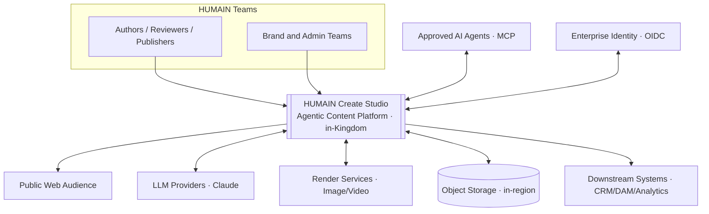
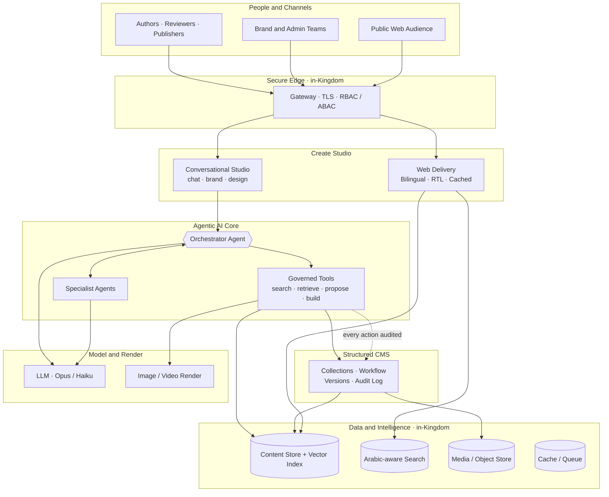
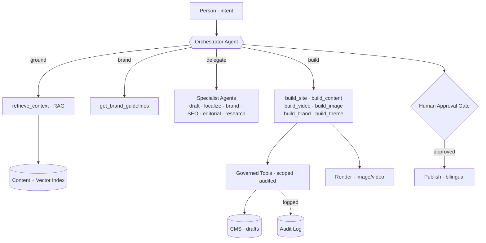
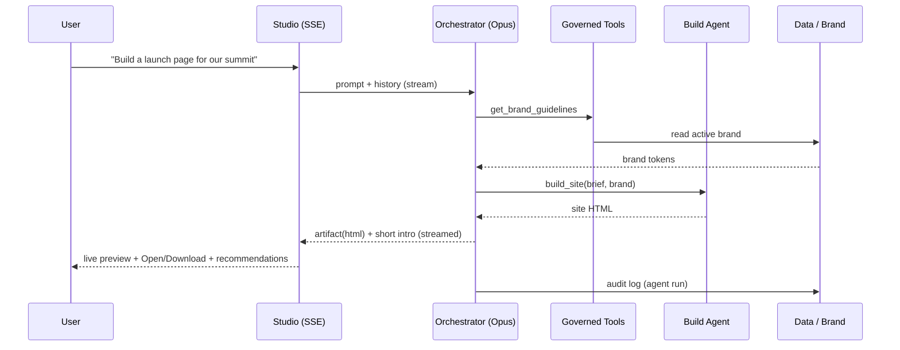
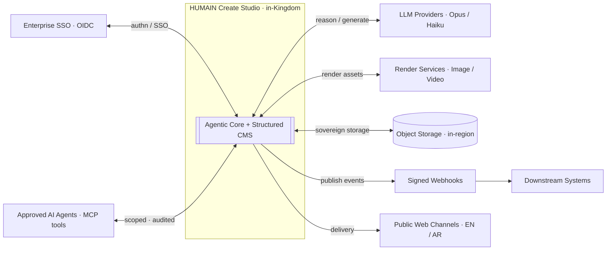
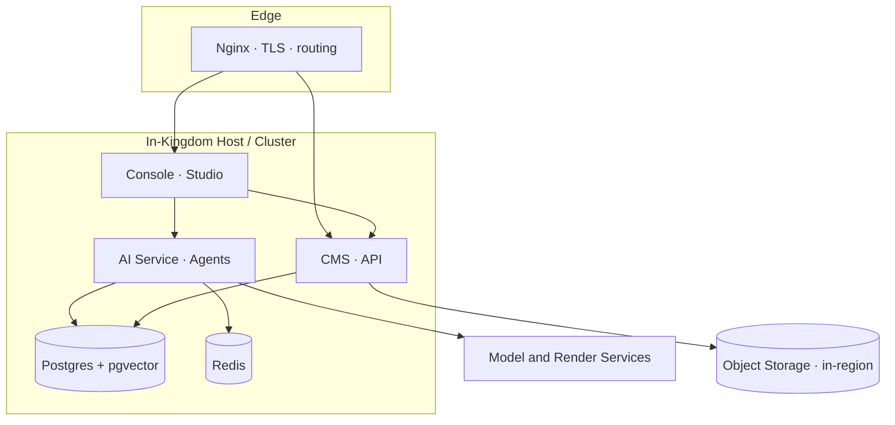

# HUMAIN Create Studio
## High-Level Architecture
### Agentic, Bilingual Content and Experience Platform

---

| | |
|---|---|
| **Document type** | High-Level Architecture |
| **Prepared for** | HUMAIN |
| **Region** | Kingdom of Saudi Arabia (KSA) — in-region |
| **Classification** | Confidential — Client Presentation |
| **Version** | 1.0 |
| **Date** | June 2026 |

---

## 1. Overview

HUMAIN Create Studio is an **agentic, AI-native content platform**. A team of specialised AI agents, coordinated by an orchestrator, turns natural-language intent into interactive, on-brand, bilingual outcomes — websites, content, brand guidelines, themes, images and video — all governed by role-based permissions, editorial gates and a complete audit trail, hosted in-Kingdom.

This document describes the system at a high level: context, components, the agentic core, data and integration architecture, request flow, deployment, and the non-functional posture.

---

## 2. System Context

The platform is the system-of-record for content; identity, models, render and storage are integrated services.

---

## 3. High-Level Architecture

---

## 4. Component View

| Component | Responsibility | Notes |
|---|---|---|
| **Edge / Gateway** | TLS termination, routing, auth, RBAC/ABAC | In-Kingdom; HTTPS only |
| **Create Studio (console)** | Conversational UI + Brand and Design surfaces | Streams agent output (SSE) |
| **Agentic AI Core (AI service)** | Orchestrator + specialists + governed tools | Tool-use loop on Claude |
| **Structured CMS** | Schema, RBAC/ABAC, editorial workflow, versions, audit | System-of-record |
| **Web Delivery** | Fast, cached, RTL-correct public rendering | Bilingual EN/AR |
| **Content Store** | Source of truth + vector embeddings | Postgres + pgvector |
| **Search** | Arabic-aware + semantic retrieval | — |
| **Object Store** | Media and rendered assets | S3-compatible, in-region |
| **Cache / Queue** | Performance + background jobs | Redis |
| **Model and Render** | LLM completion + image/video rendering | Provider-abstracted |

---

## 5. Agentic Core

The intelligence is an **orchestrator agent** running a multi-step tool-use loop. It plans, grounds itself in HUMAIN content and brand, delegates to specialist agents, and builds interactive outcomes — never a raw dump. Every tool call is audited; agents propose drafts, humans publish.

- **Orchestrator** runs on the strongest model (Opus) for reasoning/routing.
- **Specialists and generation** run on a fast model (Haiku) for cost efficiency.
- **Governed tools** are the only path to data — read (search/retrieve) and propose (drafts); never direct, unscoped writes.

---

## 6. Request Flow — "Build a website"

The same pattern serves every capability — only the build step differs (content, video, image, brand, theme).

---

## 7. Data Architecture

- **Content Store (Postgres):** the source of truth — collections, drafts, versions, workflow state, audit log.
- **Vector Index (pgvector):** sovereign, local embeddings (multilingual, 384-dim) power semantic, Arabic-aware retrieval (RAG) — no external embedding calls.
- **Search:** Arabic-aware + semantic retrieval over indexed content.
- **Object Store (S3-compatible, in-region):** media and rendered assets.
- **Cache / Queue (Redis):** performance and reliable background processing (indexing, render polling).

All content and embeddings remain **in-Kingdom**.

---

## 8. Integration Architecture

- **Provider-abstracted models** — HUMAIN is never locked to a single vendor.
- **MCP tool surface** — approved external agents act through the same governed, audited tools.
- **Signed webhooks** notify downstream systems on publish/content events.

---

## 9. Deployment Architecture

A self-contained, containerised stack, in-Kingdom, behind a TLS edge.

- **Stateless app tier** (console, CMS, AI service) — horizontally scalable.
- **Managed data tier** (Postgres+pgvector, Redis) with health checks.
- **One image, many services** — each container runs a different workload from a shared build.
- **Repeatable deploys** with image cache-busting per release and forced container recreation.

---

## 10. Security, Governance and Sovereignty

- **In-Kingdom** hosting and processing — data residency under HUMAIN's control.
- **RBAC + ABAC** at every layer (role, site-scope, department, locale).
- **Editorial gating** — Draft → In Review → Approved; agents propose drafts, humans publish.
- **Immutable audit log** of all content *and* agent actions.
- **Secrets isolation** — credentials/keys separated from content and code.
- **Secure transport** — HTTPS/TLS everywhere; secure session cookies; CORS/CSRF protection.
- **Human-in-the-loop** — nothing reaches the public without approval.

---

## 11. Technology Stack

| Layer | Technology |
|---|---|
| Console / Web | Next.js (App Router), React, SSE streaming, EN/AR RTL |
| CMS | Payload (headless), RBAC/ABAC, versioned drafts, audit |
| AI service | Node/Fastify, Anthropic Claude (Opus + Haiku), tool-use loop |
| Agents / tools | Orchestrator + specialists; MCP governed tool surface |
| Embeddings | Local multilingual model (sovereign, 384-dim) |
| Data | Postgres + pgvector; Arabic-aware search; Redis |
| Render | Image/Video via provider-abstracted services |
| Storage | S3-compatible object storage, in-region |
| Edge / Infra | Nginx + TLS; containerised; one image, many services |

---

## 12. Scalability, Reliability and Observability

- **Scalability:** stateless app tier scales horizontally; queue-backed background work absorbs spikes; cost-tuned model routing (Opus for reasoning, Haiku for generation).
- **Reliability:** health-checked data tier; restart-on-failure services; graceful degradation (a missing model/render key surfaces a friendly message, never a crash).
- **Observability:** centralised logs/metrics; every agent run and content action recorded for full traceability.

---

## Appendix A — Payload CMS v3 Security Posture

The platform's content backend is **Payload CMS v3 (3.85.0)**. Payload v3 is a secure, production-grade, actively-maintained headless CMS (Figma-backed) on the Next.js App Router; security is a shared responsibility — Payload provides the primitives, and this deployment configures and hardens them.

### A.1 Built-in security controls (Payload v3)

| Control | Detail |
|---|---|
| **Authentication** | bcrypt-hashed passwords · JWT in **httpOnly** cookies · API keys · email verification · password reset · **account lockout** (`maxLoginAttempts` / `lockTime`) |
| **Authorization** | Collection- **and** field-level access-control functions → real **RBAC + ABAC** |
| **Injection defence** | Parameterised queries via **Drizzle ORM** (Postgres) |
| **Web security** | **CORS + CSRF** controls, configurable origins; inherits the **Next.js** security model |
| **Data integrity** | Versioned drafts, editorial workflow state, audit hooks |
| **Maintenance** | Actively maintained; pinned, recent **3.85.0** |

### A.2 Applied controls in this platform

| Area | Configuration |
|---|---|
| **Transport** | HTTPS/TLS · `COOKIE_SECURE=true` · secure session cookies |
| **Access control** | **RBAC (6 roles)** + **ABAC** (site, department, locale) at collection and field level |
| **Secrets** | `PAYLOAD_SECRET` and provider keys held in environment, **not committed** to source |
| **Governance** | Editorial gating (draft → review → publish) · **immutable audit log** |
| **Agentic safety** | Agents **propose drafts**; a human approves before publish |
| **Sovereignty** | Hosted **in-Kingdom**; secrets isolated from content and code |

### A.3 Hardening checklist

- Keep Payload **patched** and monitor its security advisories.
- Strong, rotated `PAYLOAD_SECRET`; restrict `/admin` exposure; MFA for maintainers.
- **Dependency / SCA scanning** (Dependabot / Snyk / `npm audit`) in CI.
- Replace the first-boot dev schema-push with **generated Payload migrations**.
- Edge **rate-limiting / WAF**; least-privilege database and registry credentials.

> No framework is free of vulnerabilities; the correct posture is to **stay current and monitor advisories**. Most real-world risk lies in weak secrets, over-permissive access rules, leaked environment variables or unpatched dependencies — all addressed above.

---

*Prepared for HUMAIN — Confidential. High-level architecture of the HUMAIN Create Studio platform.*
