# HUMAIN Create Studio
## Master Deck
### PRD · UI/UX · Architecture — Agentic, Bilingual Content and Experience Platform

---

| | |
|---|---|
| **Document type** | Master Deck — PRD · UI/UX · Architecture |
| **Prepared for** | HUMAIN |
| **Region** | Kingdom of Saudi Arabia (KSA) — in-region |
| **Classification** | Confidential — Client Presentation |
| **Version** | 1.0 |
| **Date** | June 2026 |

---

## Contents

- **Part I — Product Requirements** — vision, scope, requirements, business impact, the agentic platform, and product snapshots.
- **Part II — UI/UX & User Journeys** — design system, navigation, interaction patterns, and the journey for every capability.
- **Part III — High-Level Architecture** — system context, agentic core, data, integration, deployment and security.

# Part I — Product Requirements

## 1. Executive Summary

HUMAIN Create Studio is a **bilingual (Arabic + English), agentic AI-native content and digital-experience platform** designed to let marketing, communications, editorial and brand teams produce on-brand, governed, multilingual content at a fraction of the cost and time of traditional content management systems.

At its core is a team of **specialised AI agents** that plan and carry out the multi-step work of content production — drafting, translating, optimising, brand-checking and assembling publish-ready experiences — operating through a **governed, audited tool layer** so that every agent action is permission-scoped, logged and reversible, with humans approving anything that goes live.

The platform unifies two experiences over a **single content store and a single brand system**:

- **Create Studio** — a light, prompt-first surface where a person describes intent in natural language and the agents draft, translate, optimise and assemble publish-ready content.
- **Structured CMS** — a governed, enterprise-grade content backend providing the schema, roles, editorial workflow, versioning and audit trail demanded by a regulated, brand-sensitive organisation.

Both surfaces are powered by an **agentic AI backbone**: orchestrated agents that reason over the brief, retrieve relevant context (RAG), call governed content tools, and chain steps to a finished deliverable — every action governed by role-based permissions and a complete audit log.

> **The objective:** reduce content production cost and cycle-time by an order of magnitude, while *raising* brand consistency, governance and Arabic-first quality — all hosted in-Kingdom under HUMAIN's control.

*Snapshots of the working platform are in **Appendix A**.*

---

## 2. Business Context and Drivers

| Driver | Current-state challenge | Platform response |
|---|---|---|
| **Arabic-first communication** | Most CMS platforms treat Arabic/RTL as an afterthought; translation is manual and inconsistent | Native EN⇄AR with right-to-left rendering and AI-assisted, tone-preserving translation as a first-class capability |
| **Content velocity** | Producing a single bilingual page can take days across writers, translators, designers and reviewers | Prompt-to-draft in minutes; AI assists every step from brief to publish |
| **Brand consistency** | Brand drift across teams, agencies and channels | A central brand and design-token system that every piece of content inherits and is checked against |
| **Governance and sovereignty** | Sensitive content on foreign-hosted SaaS; weak audit trails | In-Kingdom, self-hosted deployment with role-based access, editorial gates and full audit logging |
| **Cost of tooling** | Per-seat SaaS licences + separate translation, SEO and DAM tools | One consolidated platform owned by HUMAIN, no per-seat lock-in |

---

## 3. Vision and Goals

**Vision:** *Let anyone at HUMAIN turn an idea into a published, on-brand, bilingual digital experience — by describing it, not by operating a tool.*

**Primary goals**

1. **G1 — Speed:** Reduce average content production cycle-time by ≥ 70%.
2. **G2 — Bilingual quality:** Deliver publish-grade Arabic and English from a single workflow, with translation parity.
3. **G3 — Brand integrity:** Guarantee every published asset inherits approved brand tokens and guidelines.
4. **G4 — Governance:** Enforce who-can-do-what with a complete, queryable audit trail.
5. **G5 — Sovereignty:** Keep all content and AI processing under HUMAIN's control, in-Kingdom.

---

## 4. Business Impact and Value

### 4.1 Quantified impact (target outcomes)

| Metric | Baseline (typical) | Target with Create Studio | Impact |
|---|---|---|---|
| Time to produce a bilingual page | 2–4 days | 2–4 hours | **~85% faster** |
| Translation turnaround (EN⇄AR) | 1–2 days per asset | Minutes (AI draft + human review) | **~90% faster** |
| SEO metadata coverage | Manual / inconsistent | Auto-generated for 100% of content | **Full coverage** |
| Brand-compliance review effort | High, manual | Guided by system, exception-only | **Major reduction** |
| Tooling consolidation | 3–5 separate tools | 1 platform | **Lower TCO + simpler ops** |
| Content reuse | Low (copy-paste) | Block-based, versioned, reusable | **Higher consistency** |

### 4.2 Strategic value

- **Sovereign capability** — a national-grade content platform owned and operated in-Kingdom, not rented from abroad.
- **Scalable team output** — small teams produce at large-team volume; specialists focus on judgement, not mechanics.
- **Compounding brand equity** — every asset is consistent by construction, strengthening brand over time.
- **Defensible governance** — auditable, role-gated workflows suitable for regulated and high-visibility communications.

---

## 5. Scope

### 5.1 In scope
- Prompt-first authoring (Create Studio) and structured CMS administration.
- Bilingual EN/AR content with RTL support.
- AI assistance: drafting, translation, summarisation, SEO, tagging, headline variants, FAQ generation, image alt-text, marketing copy.
- Block-based page composition and reusable content blocks.
- Editorial workflow, role-based access, versioning and audit logging.
- Brand and design-token management.
- Semantic + Arabic-aware search.
- Media management and AI-assisted/asynchronous video rendering.
- Secure delivery of published content to web channels.

### 5.2 Out of scope (this phase)
- Paid media / ad-buying automation.
- Native mobile applications (content is delivered to responsive web).
- Third-party social scheduling (available as a future integration).

---

## 6. Personas and Roles

The platform is **role-governed**. Each persona sees only what their role permits. The model is **7 roles realising 9 personas** — the same role is specialised into distinct personas by **ABAC scope attributes** (site, department, and content locale) rather than by minting a separate role per scope. This keeps the permission surface small and auditable while still giving each persona a precise remit.

| Persona | Role | Scope (ABAC) | Primary jobs-to-be-done |
|---|---|---|---|
| **Platform Administrator** | `admin` | Global, unrestricted | Configure platform, manage users and roles, oversee all content and settings |
| **Site Administrator** | `siteAdmin` | Site-scoped (`sites`) | Own a specific site/brand surface end-to-end — create, review and publish within that site; **cannot** manage users or global settings |
| **Author (EN)** | `author` | Locale = EN | Draft and edit English content with AI assistance |
| **Author (AR)** | `author` | Locale = AR | Draft and edit Arabic content with AI assistance |
| **Reviewer** | `reviewer` | Site-scoped | Move content through editorial gates; quality-check |
| **Publisher** | `publisher` | Site-scoped | Approve and publish to live channels |
| **Brand Manager** | `brand` | Global brand assets | Own brand guidelines and design tokens |
| **Department Author (e.g. HR)** | `author` | Department-scoped (`department`) | Produce department content within guardrails (e.g. HR owns Careers) |
| **Viewer** | `viewer` | Read-only | Read-only access to published content and dashboards |

**The 7 roles** are `admin`, `siteAdmin`, `author`, `reviewer`, `publisher`, `brand`, and `viewer`. **The 9 personas** above are these roles combined with scope attributes — e.g. *Author (EN)* and *Author (AR)* are both the `author` role distinguished by their **locale** scope, and *Department Author* is `author` distinguished by its **department** scope. `siteAdmin` is the one genuinely distinct authority introduced for the Site Administrator persona: site-scoped admin powers (create / review / publish within its sites) without platform-level user, role, or global-settings control, so it cannot escalate privileges. **All scope attributes are access-enforced, not advisory:** site and department scopes gate read/write at collection and field level, and **locale scope is a hard write boundary** — an author assigned a locale (e.g. EN) cannot create or edit content in another locale (AR), and vice-versa (empty = all locales). This makes every one of the nine personas a distinct, enforced authorization profile.

---

## 7. Functional Requirements

### 7.1 Create Studio — Prompt-First Authoring
- **FR-1** The system **shall** let a user generate publish-ready drafts from a natural-language brief.
- **FR-2** The system **shall** provide guided AI actions on any content: *summarise, translate, generate SEO, suggest headlines, generate FAQs, write alt-text, draft marketing copy, extract tags.*
- **FR-3** The system **shall** preview content live in both English and Arabic, including correct RTL layout.
- **FR-4** The system **shall** present a unified workspace covering Projects, Content, Brand, Design System, and Search.

### 7.2 Structured Content Management
- **FR-5** The system **shall** model content as governed collections (pages, articles, blog posts, FAQs, sites, media, brand guidelines, users).
- **FR-6** The system **shall** compose pages from **reusable, versioned content blocks**: Hero, Rich Text, Media, CTA, Cards, FAQ, Stats, Quote, Gallery, Embed, Features, Steps, and Logos.
- **FR-7** The system **shall** autosave drafts and retain a version history per document, enabling rollback.
- **FR-8** Content **shall** be scoped to a *site*, so teams only touch the surfaces they own (attribute-based access).

### 7.3 Bilingual and Localisation
- **FR-9** Every content field **shall** support per-locale values (EN/AR) with independent draft/published state.
- **FR-10** The system **shall** provide AI-assisted EN⇄AR translation that preserves meaning and tone, always followed by human review.
- **FR-11** The delivery layer **shall** render Arabic right-to-left with correct typography.
- **FR-11a** The **platform UI itself shall be switchable between English and Arabic** — one click, with full right-to-left layout and Arabic typography — independently of the content locale.

### 7.4 Editorial Workflow and Governance
- **FR-12** Content **shall** progress through an editorial gate: **Draft → In Review → Approved**, with only authorised roles able to advance it.
- **FR-13** Publishing **shall** be permission-gated; unauthorised users cannot push content live and are guided to save as draft or request review.
- **FR-14** Every create/update/delete/publish action **shall** be recorded in an immutable **audit log**.
- **FR-14a** Access control **shall** combine **RBAC (7 roles)** with **ABAC** (site, department, locale) at both collection and field level; roles and access scope **shall** be editable by platform admins only, so a user cannot escalate their own privileges, and a `siteAdmin` is confined to its assigned sites and excluded from global settings.
- **FR-14b** The system **shall** provide a **user and access administration** screen showing each account's roles, department, ABAC scope, active status and **creation date**, with an at-a-glance RBAC capability matrix.

### 7.5 Brand and Design System
- **FR-15** The system **shall** maintain centrally managed **brand guidelines** and **design tokens** (colours, type, spacing) shared by all surfaces.
- **FR-16** The system **shall** offer AI-assisted brand-guideline suggestions to accelerate brand setup and evolution.

### 7.6 Intelligent Search
- **FR-17** The system **shall** provide search across all content, including **Arabic-aware** and **semantic (meaning-based)** retrieval.

### 7.7 Media and Video
- **FR-18** The system **shall** manage media assets with AI-generated descriptive alt-text for accessibility.
- **FR-19** The system **shall** support **asynchronous video rendering** with status tracking.

### 7.8 Agent and Integration Surface
- **FR-20** The system **shall** expose a governed, audited tool interface (search / retrieve / propose content) for approved AI agents and downstream systems.

---

## 8. Non-Functional Requirements

| Category | Requirement |
|---|---|
| **Sovereignty** | All content, data and AI processing hosted **in-Kingdom (KSA)**, under HUMAIN's control. |
| **Security** | Role-based + attribute-based access control; secure cookies; CORS/CSRF protection; secrets isolated from content. |
| **Auditability** | Complete, queryable audit trail of all content actions. |
| **Localisation** | First-class EN + AR (RTL); Arabic-aware search and translation. |
| **Performance** | Sub-second authoring interactions; cached, incrementally-rendered public delivery. |
| **Scalability** | Horizontally scalable services; queue-backed background processing for heavy jobs. |
| **Reliability** | Stateless application tier; managed data tier with health monitoring. |
| **Extensibility** | Provider-abstracted AI layer — model choice can evolve without re-platforming. |
| **Observability** | Centralised logs, metrics and tracing for operations. |

---

## 9. Proposed Solution Architecture

### 9.1 High-level architecture

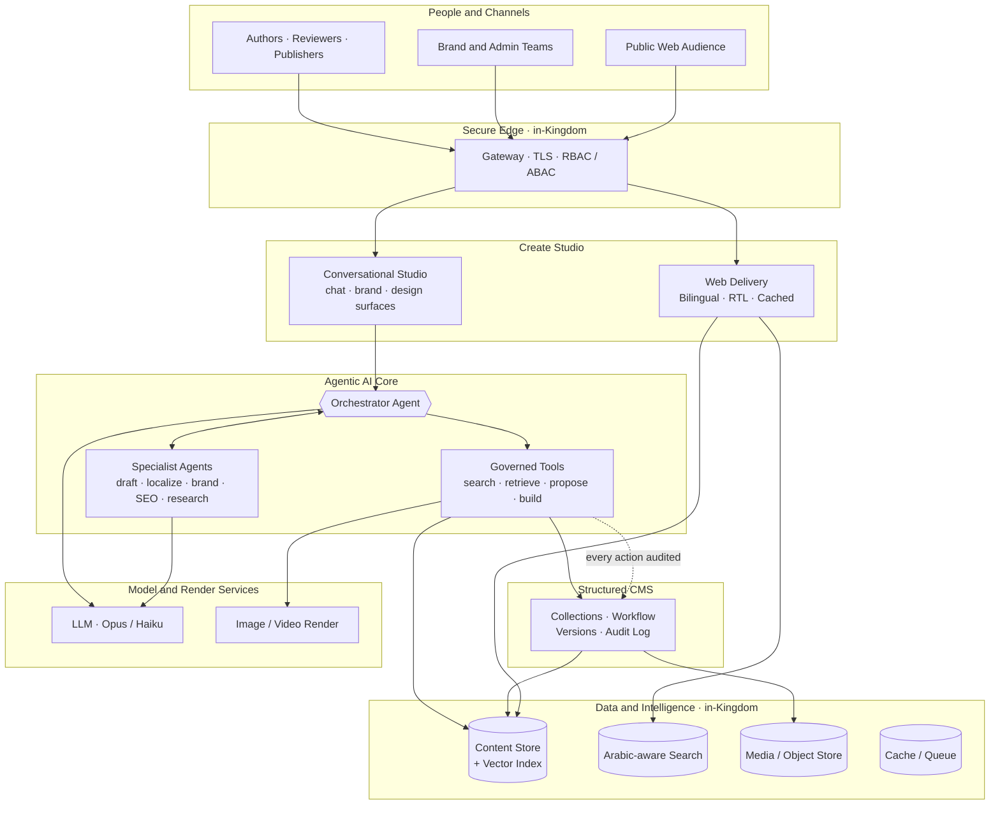

### 9.2 Logical components

| Layer | Responsibility |
|---|---|
| **Create Studio** | Natural-language authoring, AI actions, live bilingual preview |
| **Structured CMS** | Content schema, roles, editorial workflow, versioning, audit |
| **AI Service** | Drafting, translation, SEO, tagging, summarisation, semantic indexing |
| **Web Delivery** | Fast, cached, RTL-correct public rendering |
| **Content Store** | Single source of truth + vector embeddings for semantic search |
| **Search Index** | Arabic-aware and semantic retrieval |
| **Cache / Queue** | Performance + reliable background processing (e.g. video, indexing) |
| **Object Store** | Media and rendered assets, in-region |

---

## 10. Content Lifecycle

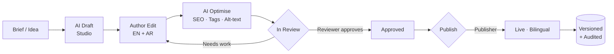

Every transition is **role-gated** and **logged**.

---

## 11. Role and Permission Model

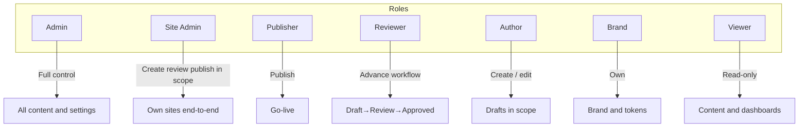

- **7 roles → 9 personas:** `admin`, `siteAdmin`, `author`, `reviewer`, `publisher`, `brand`, `viewer` cover all nine personas (see §6); locale and department personas are the `author` role differentiated by ABAC scope.
- **Site scoping (ABAC):** site admins, authors and editors act only on the sites assigned to them (empty = all).
- **Department scoping:** departmental authors are confined to their department's content.
- **No privilege escalation:** `siteAdmin` has site-scoped editorial authority but cannot manage users, roles or global settings — only `admin` can.

---

## 12. Agentic AI Platform

The platform's intelligence is delivered by a team of **specialised AI agents**, each owning a step of the content lifecycle and coordinated by an **orchestrator**. Agents are goal-directed and multi-step: given a brief or objective, they plan the work, retrieve relevant context, act through governed tools, check their own output, and hand off to one another until a publish-ready deliverable exists — with a human approving anything that goes live.

### 12.1 What makes it agentic

- **Goal-directed** — agents work from an objective ("produce a bilingual launch page from this brief"), not a single canned prompt.
- **Multi-step and self-checking** — they plan → retrieve → act → verify, iterating until the result meets brand and quality criteria.
- **Tool-using** — agents act only through a **governed tool layer** (search, retrieve, propose) rather than touching data directly.
- **Context-aware (RAG)** — they ground output in HUMAIN's own content and brand tokens via semantic, Arabic-aware retrieval.
- **Collaborative** — specialised agents hand off to each other under the orchestrator's plan.
- **Governed** — every agent runs under the same role/permission model as people, every action is audited, and **agents propose — humans dispose**.

### 12.2 Agent catalogue

| Agent | What it does | Acts through |
|---|---|---|
| **Orchestrator** | Interprets the brief, plans the steps, delegates to specialist agents, assembles the final deliverable | Plan + governed tools |
| **Drafting Agent** | Turns a brief into a structured, block-based draft | `content_propose` |
| **Localization Agent** | Produces EN⇄AR translations with tone and meaning parity | `content_get` / `propose` |
| **Brand Guardian Agent** | Checks tone and visual tokens against brand guidelines; flags drift before review | Brand tokens + `content_get` |
| **SEO and Discovery Agent** | Generates metadata, keywords, taxonomy tags and internal-link suggestions | `content_search` / `propose` |
| **Research / Retrieval Agent** | Grounds output in HUMAIN's own content via semantic, Arabic-aware retrieval (RAG) | `content_search` |
| **Media Agent** | Generates descriptive alt-text and orchestrates image/video rendering | Media + render tools |
| **Editorial Agent** | Summarises changes, prepares review notes, routes content through the workflow gates | Workflow + `content_get` |

### 12.3 Orchestration and governance

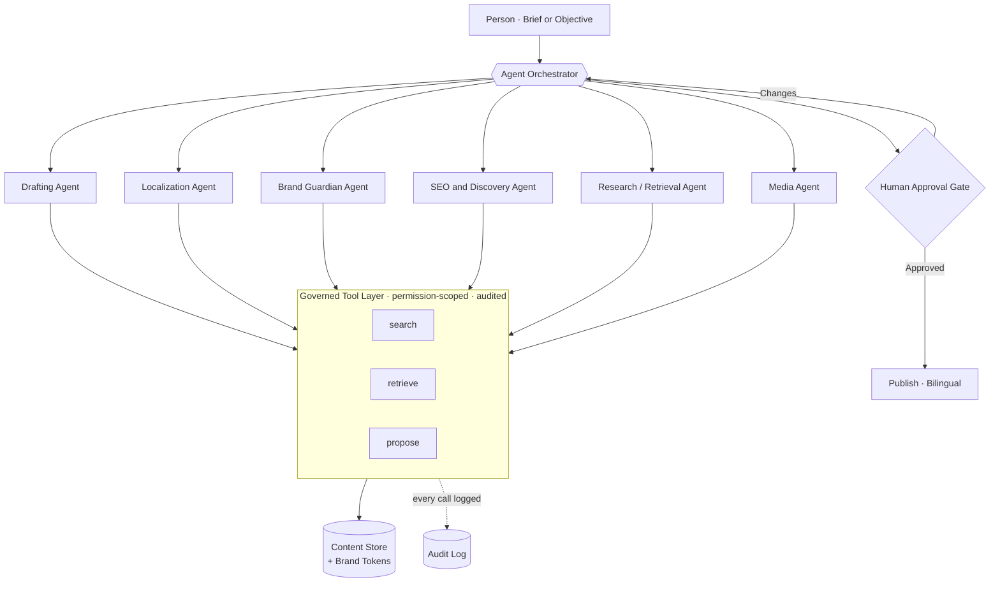

- Agents operate under the **same RBAC/ABAC** as human users — an agent can only touch content its scope permits.
- Agents **propose**; they **cannot publish**. A human approval gate stands before go-live.
- **Every agent tool call is written to the audit log**, giving a complete, queryable record of what each agent did and why.
- The agent runtime is **provider-abstracted** — HUMAIN is never locked to a single model vendor, and the strongest model can be assigned per task.

### 12.4 What the agent builds

From one conversation, the agent decides what is needed and **builds a complete, interactive, usable outcome** — not just a suggestion of copy:

| Outcome | What the user gets |
|---|---|
| **Website / landing page / app** | A complete, responsive site **built and previewed live in chat**, with Open / Download |
| **Structured content** | Article, blog, page, press release, event, product, case study, FAQ, email, campaign or social post — an **editable card** that can be **published to a CMS module** (as a draft for review) or downloaded |
| **Video** | A production-ready script / storyboard with a **one-click render** to a real video |
| **Image** | A **generated image**, rendered inline |
| **Brand guideline** | A full guideline to verify, **publish as the active brand the agents follow**, or download |
| **Design theme** | A complete colour / type / radius theme with live preview, **applied to the platform** |

The agent draws on direct assist skills too — each also a one-click action: **drafting, EN⇄AR translation, SEO metadata, summarisation, headline variants, FAQ generation, taxonomy tagging, image alt-text** and **semantic, Arabic-aware search**.

> **Agents act; humans decide.** No content reaches the public without human approval, and every agent action is permission-scoped and logged.

---

## 13. Integration Requirements

| Integration | Purpose |
|---|---|
| **Enterprise SSO (OIDC)** | Single sign-on with HUMAIN identity |
| **Object storage (S3-compatible, in-region)** | Sovereign media and asset storage |
| **Webhooks (signed)** | Notify downstream systems on publish / content events |
| **Agent tool interface** | Governed programmatic access for approved AI agents |
| **Web channels** | Deliver published, bilingual content to public sites |
| **LLM and render services** | Provider-abstracted models (Opus/Haiku) + image/video rendering |

### 13.1 Integration architecture

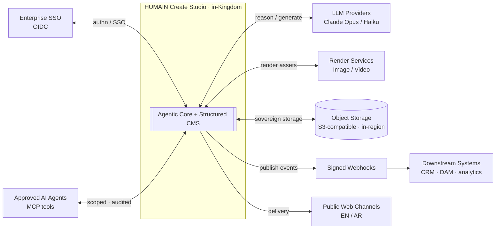

---

## 14. Security, Compliance and Sovereignty

- **In-Kingdom hosting** — data residency under HUMAIN's control.
- **Role-based + attribute-based access control** at every layer.
- **Editorial gating** prevents unreviewed or unauthorised publishing.
- **Immutable audit log** of all content actions for accountability.
- **Secrets isolation** — credentials and keys separated from content and code.
- **Secure transport** — encrypted (HTTPS/TLS) across all surfaces; secure session cookies; CORS/CSRF protections.

---

## 15. Delivery Roadmap and Status

The core programme (Phases 1–2) is **delivered and live** in-Kingdom; Phase 3 is **underway** (the agentic build set and MCP tool surface are already shipped).

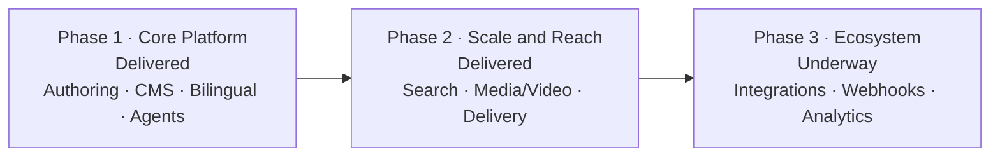

| Phase | Outcome | Focus | Status |
|---|---|---|---|
| **Phase 1 — Core Platform** | Teams author, translate and govern bilingual content | Studio, CMS, RBAC, workflow, agentic AI, brand tokens | ✅ Delivered |
| **Phase 2 — Scale and Reach** | Content is discoverable and richly delivered | Arabic-aware semantic search, media/video, cached public delivery | ✅ Delivered |
| **Phase 3 — Ecosystem** | Platform extends across HUMAIN's stack | Agent/MCP integrations, signed webhooks, advanced analytics | ◑ Underway |

---

## 16. Success Metrics (KPIs)

| KPI | Target |
|---|---|
| Bilingual content cycle-time reduction | ≥ 70% |
| SEO metadata coverage | 100% of published content |
| Brand-compliance exceptions at publish | Trending to near-zero |
| Translation review effort | ≥ 80% reduction vs. manual |
| Audit completeness | 100% of content actions logged |
| Author satisfaction (time-to-publish) | Measurable improvement quarter-on-quarter |

---

## 17. Assumptions and Dependencies

- HUMAIN provides in-region infrastructure (or approves the proposed hosting) and an OIDC identity provider.
- Content owners define the initial brand guidelines and design tokens.
- AI model access is provisioned within HUMAIN's approved policy.
- Human review remains in the loop for all AI-assisted output prior to publish.

---

## 18. Glossary

| Term | Meaning |
|---|---|
| **Create Studio** | The prompt-first authoring experience |
| **Block** | A reusable, versioned content component used to compose pages |
| **Design tokens** | Centralised brand values (colour, type, spacing) shared across surfaces |
| **RTL** | Right-to-left layout, required for Arabic |
| **RBAC / ABAC** | Role-based / attribute-based access control |
| **Semantic search** | Meaning-based retrieval beyond keyword matching |
| **Audit log** | Immutable record of all content actions |
| **In-Kingdom** | Hosted and processed within Saudi Arabia for data sovereignty |

---

## Appendix A — Product Snapshots

The following snapshots are taken from the working HUMAIN Create Studio platform, showing the realized capabilities described above.

### A.1 Secure bilingual sign-in

Branded, HTTPS sign-in backed by role-based access (OIDC-ready). Every session is permission-scoped.

### A.2 Create Studio — one prompt box for everything

A single conversational entry point. The agent decides what to build; recent work and quick-create paths sit alongside.

### A.3 Conversational, on-brand assistant

Natural, streaming replies (not form dumps) with rich formatting — the assistant explains what it can build, recommends next steps, and works bilingually (EN/AR), grounded in the active brand.

### A.4 Build a website — live, in-chat preview

Ask for a site and the agent **builds it**, rendered live in the conversation with Open / Download — not a description. The same pattern produces editable, publishable content, images and video.

### A.5 Design System — prompt-driven, agent-governed theme

Describe a look and the agent generates a complete theme (palette, type, radius, light/dark) with a live preview; tokens are shared across every surface, EN + AR.

### A.6 Brand Studio — recommend → review → publish

The AI recommends a full brand guideline to review and verify, then publish as the **active brand the agents follow**, or download.

### A.7 Bilingual platform UI — English / Arabic

A one-click language switch turns the entire platform UI to **Arabic with full right-to-left layout** (and back to English) — navigation, prompts and actions all localised. The same content store serves both languages.

# Part II — UI/UX and User Journeys

## 1. Design Principles

The experience is built on six principles, each visible in the product:

- **Agent-first, not form-first.** A person describes intent in natural language; the agent decides what to build and produces an interactive result. Forms are the fallback, never the starting point.
- **Conversational, like Claude.** Replies stream in as natural messages with light actions (Copy, Retry) — not boxed reports. The assistant asks a clarifying question when needed and recommends next steps.
- **Always an interactive outcome.** Every capability returns something the user can *use* — a live website preview, an editable/publishable card, a theme to apply — never a dead-end text dump.
- **Bilingual by design.** English and Arabic are first-class, including right-to-left layout; the type system carries both (Inter + IBM Plex Sans Arabic).
- **On-brand by construction.** Every surface inherits the central brand tokens; the agent grounds output in the active brand.
- **Governance you can see.** Roles, review gates, publish-as-draft and a complete audit trail are part of the flow — agents propose, humans decide.

---

## 2. Visual Design System

A single token system (colour, typography, spacing, radius) drives every surface, in light and dark, EN and AR. It is itself **prompt-driven** — a user can describe a look and the agent generates a complete, accessible theme with a live preview.

- **Palette:** primary teal, primary-dark, lime accent, ink, canvas, muted — each with usage.
- **Typography:** Inter (Latin) + IBM Plex Sans Arabic (Arabic), shared scale.
- **Shape and surface:** configurable corner radius; light/dark surfaces; generous whitespace.

---

## 3. Navigation and Information Architecture

A persistent left sidebar gives one-click access to every capability; the workspace fills the rest.

- **Create new** — start a fresh conversation.
- **Search** — find across content (semantic, Arabic-aware).
- **Projects** — everything produced, as reusable assets.
- **Templates** — structured content modules.
- **Brand** — Brand Studio (recommend → publish brand guidelines).
- **Design** — Design System (prompt-driven theme).

The Studio home is a **single prompt box**: the user types intent and the agent routes to the right outcome — no need to pick a tool first.

---

## 4. Core Interaction Patterns

- **Conversation thread** — user messages (right) and natural assistant replies (left), streamed live.
- **Artifact cards** — when the agent builds something, it appears inline as an interactive card: a website preview, a content card, a brand card, a theme.
- **Action row** — under each reply: Copy, Retry, and the model used.
- **Manual override** — every generated artifact can be edited by hand (the human is never locked out).
- **Publish / Download** — outcomes can be published (to a CMS module or as the active brand, as a draft for review) or downloaded.

---

## 5. User Journeys

Each journey below is shown as it appears in the product, with the step-by-step UI/UX.

### 5.1 Sign in

**Journey:** 1) The user opens the branded sign-in over HTTPS. 2) Enters email + password (OIDC-ready for SSO). 3) On success a secure, role-scoped session starts and they land in Create Studio — seeing only what their role permits.

### 5.2 Converse with the assistant

**Journey:** 1) The user types a question or a greeting. 2) The assistant **replies conversationally** (it does not over-build) — here it explains what it can create, in a richly formatted, scannable message. 3) It recommends concrete next steps and invites a follow-up. 4) The user can Copy or Retry the reply. *UX note: simple input → conversation, not a form dump.*

### 5.3 Build a website

**Journey:** 1) The user asks for a site ("build a launch page for our summit"). 2) If details are missing the agent asks one quick question; otherwise it **builds it**. 3) The finished site renders **live in the conversation** with **Open** and **Download**. 4) The agent introduces it and suggests edits ("translate to Arabic", "add a pricing section"). 5) A follow-up refines the same site in place.

### 5.4 Create and publish content

**Journey:** 1) The user asks for content (blog post, article, press release, FAQ, email…). 2) The agent returns an **editable content card** — title, body (rich), summary, auto-tags. 3) The user can **Edit** (manual override), **Copy** or **Download**. 4) They choose a destination module from the **Publish to** dropdown and publish — it lands as a **draft for review** (agents propose, humans approve).

### 5.5 Generate a video

**Journey:** 1) The user asks for a video/teaser. 2) The agent produces a **production-ready package** — logline, concept, scene-by-scene script, shot list, storyboard. 3) A one-click **Render** control turns the script into a real video. 4) The user can refine tone, length or scenes in a follow-up.

### 5.6 Recommend and activate a brand

**Journey:** 1) The user describes the brand (industry, audience, tone) — or opens an archetype from the Library. 2) The AI **recommends a full guideline** (essence, voice, palette, typography, messaging). 3) The user **reviews and verifies**, editing any section. 4) They **Publish** it — as the **active brand the agents follow**, or to the library — or **Download** it.

### 5.7 Generate a design theme

**Journey:** 1) In **Describe your design**, the user types a vibe ("bold fintech — deep navy, electric lime, dark mode"). 2) The agent generates a **complete theme** (palette, font, radius, light/dark). 3) The **live preview** updates instantly; the user fine-tunes any token by hand. 4) **Apply** saves it to site settings.

### 5.8 Manage projects

**Journey:** 1) Everything the user creates is saved as a **Project** asset. 2) They browse, search and reopen prior work. 3) Each project is typed (website, content, brand, video…) and ready to promote into the CMS.

### 5.9 Switch the platform language (English / Arabic)

**Journey:** 1) From the sidebar user menu the user picks **English** or **العربية**. 2) The entire platform UI switches instantly — selecting Arabic flips everything to **right-to-left** with the Arabic type system. 3) Navigation, greeting, prompt, quick actions and menus are localised. 4) The choice persists across sessions.

---

## 6. Accessibility and Localization

- **EN + AR with correct RTL** across authoring and delivery.
- **Bilingual typography** baked into the token system.
- **Keyboard + voice input** on the prompt box; readable contrast in light and dark.
- **Descriptive alt-text** generated for media by default.

---

## 7. Roles and Responsibilities

The platform is **role-governed**: **7 roles realise 9 personas**, with the same role specialised by **ABAC scope** (site, department, content locale). Each persona sees only what its role and scope permit.

| Persona | Role | Scope (ABAC) | What they see and can do |
|---|---|---|---|
| **Platform Administrator** | `admin` | Global | Configure the platform, users, roles and settings, with full visibility |
| **Site Administrator** | `siteAdmin` | Site-scoped | Own a site/brand surface end-to-end — create, review and publish **within that site**; cannot manage users or global settings |
| **Author (EN)** | `author` | Locale = EN | Create and edit English drafts in scope, with full agent assistance |
| **Author (AR)** | `author` | Locale = AR | Create and edit Arabic drafts in scope, with full agent assistance |
| **Reviewer** | `reviewer` | Site-scoped | Advance content through the editorial gate |
| **Publisher** | `publisher` | Site-scoped | Approve and publish to live channels |
| **Brand Manager** | `brand` | Brand assets | Own the brand guidelines and the active brand |
| **Department Author (e.g. HR)** | `author` | Department-scoped | Produce department content within guardrails (e.g. HR owns Careers) |
| **Viewer** | `viewer` | Read-only | Read-only access to published content and dashboards |

The 7 roles are `admin`, `siteAdmin`, `author`, `reviewer`, `publisher`, `brand`, `viewer`. Every action a persona takes is permission-scoped (RBAC + ABAC, enforced at collection **and** field level) and written to the audit log. Publishing is permission-gated — an author who lacks rights is told to save as draft or request review — and roles/scope can only be changed by a platform admin, so no one can escalate their own privileges.

### 7.1 User and access management

**Settings → Users** lists every account with its **role(s)**, **department**, **ABAC scope** (sites / locales), **status** (active or disabled) and the **date the account was created**. Admins create, edit, deactivate or delete users here; role and scope assignment is admin-only. **Settings → Access & Roles** shows the live RBAC capability matrix alongside the ABAC rules (site, department, locale, field-level).

# Part III — High-Level Architecture

## 1. Overview

HUMAIN Create Studio is an **agentic, AI-native content platform**. A team of specialised AI agents, coordinated by an orchestrator, turns natural-language intent into interactive, on-brand, bilingual outcomes — websites, content, brand guidelines, themes, images and video — all governed by role-based permissions, editorial gates and a complete audit trail, hosted in-Kingdom.

This document describes the system at a high level: context, components, the agentic core, data and integration architecture, request flow, deployment, and the non-functional posture.

---

## 2. System Context

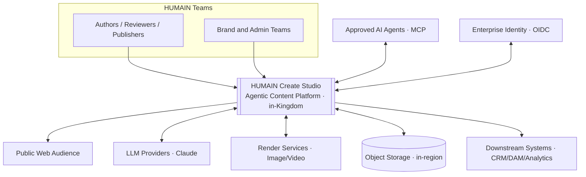

The platform is the system-of-record for content; identity, models, render and storage are integrated services.

---

## 3. High-Level Architecture

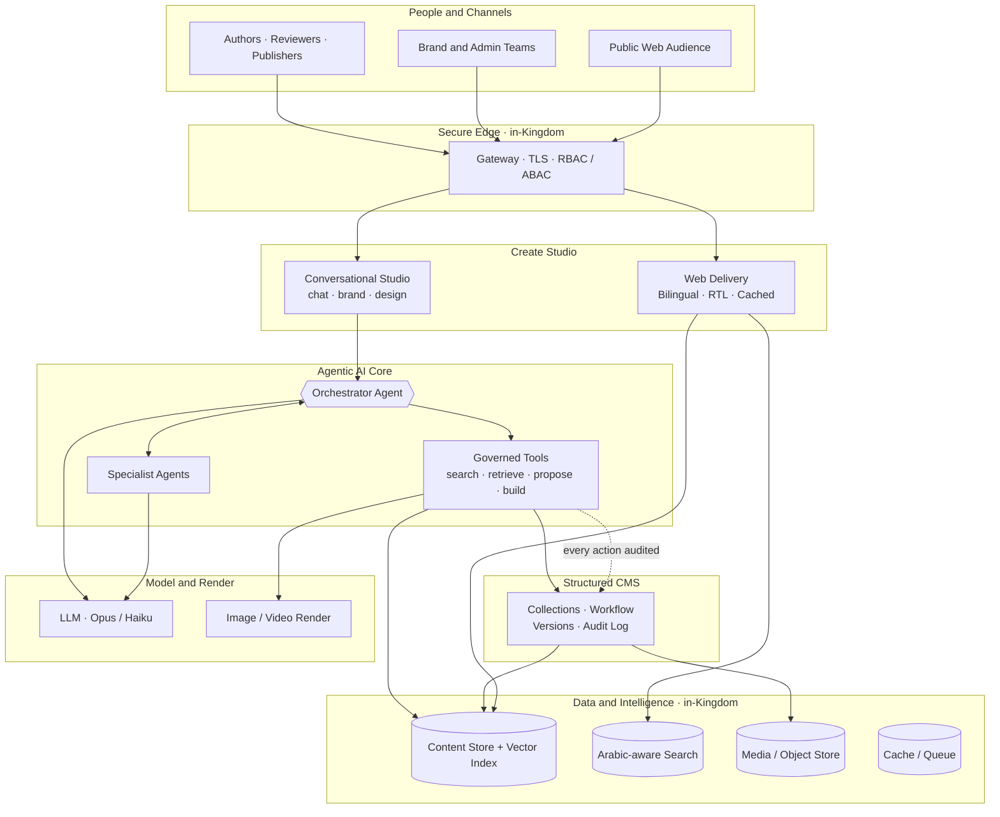

---

## 4. Component View

| Component | Responsibility | Notes |
|---|---|---|
| **Edge / Gateway** | TLS termination, routing, auth, RBAC/ABAC | In-Kingdom; HTTPS only |
| **Create Studio (console)** | Conversational UI + Brand and Design surfaces | Streams agent output (SSE) |
| **Agentic AI Core (AI service)** | Orchestrator + specialists + governed tools | Tool-use loop on Claude |
| **Structured CMS** | Schema, RBAC/ABAC, editorial workflow, versions, audit | System-of-record |
| **Web Delivery** | Fast, cached, RTL-correct public rendering | Bilingual EN/AR |
| **Content Store** | Source of truth + vector embeddings | Postgres + pgvector |
| **Search** | Arabic-aware + semantic retrieval | — |
| **Object Store** | Media and rendered assets | S3-compatible, in-region |
| **Cache / Queue** | Performance + background jobs | Redis |
| **Model and Render** | LLM completion + image/video rendering | Provider-abstracted |

---

## 5. Agentic Core

The intelligence is an **orchestrator agent** running a multi-step tool-use loop. It plans, grounds itself in HUMAIN content and brand, delegates to specialist agents, and builds interactive outcomes — never a raw dump. Every tool call is audited; agents propose drafts, humans publish.

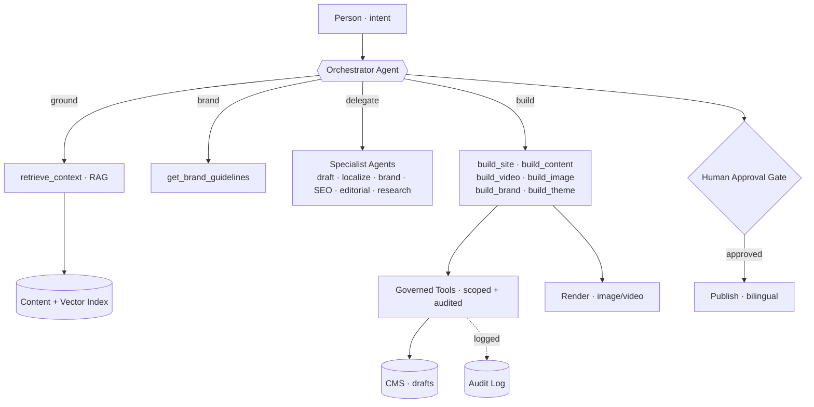

- **Orchestrator** runs on the strongest model (Opus) for reasoning/routing.
- **Specialists and generation** run on a fast model (Haiku) for cost efficiency.
- **Governed tools** are the only path to data — read (search/retrieve) and propose (drafts); never direct, unscoped writes.

---

## 6. Request Flow — "Build a website"

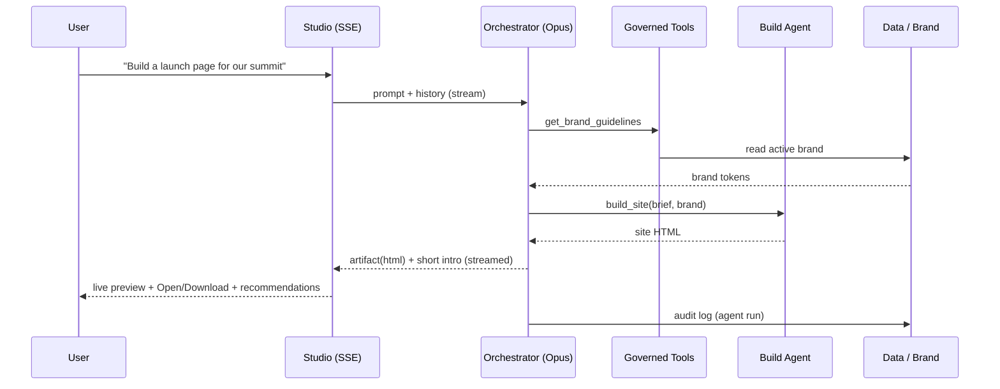

The same pattern serves every capability — only the build step differs (content, video, image, brand, theme).

---

## 7. Data Architecture

- **Content Store (Postgres):** the source of truth — collections, drafts, versions, workflow state, audit log.
- **Vector Index (pgvector):** sovereign, local embeddings (multilingual, 384-dim) power semantic, Arabic-aware retrieval (RAG) — no external embedding calls.
- **Search:** Arabic-aware + semantic retrieval over indexed content.
- **Object Store (S3-compatible, in-region):** media and rendered assets.
- **Cache / Queue (Redis):** performance and reliable background processing (indexing, render polling).

All content and embeddings remain **in-Kingdom**.

---

## 8. Integration Architecture

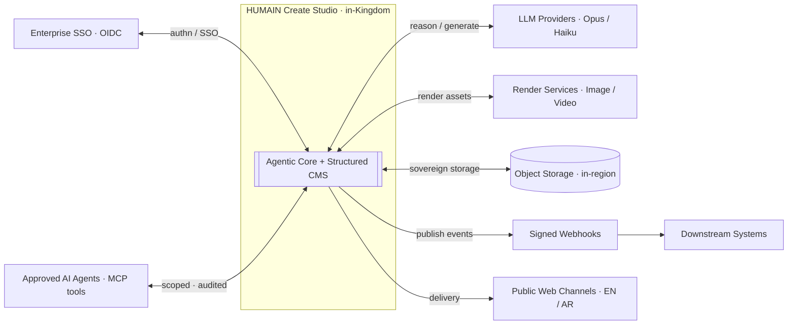

- **Provider-abstracted models** — HUMAIN is never locked to a single vendor.
- **MCP tool surface** — approved external agents act through the same governed, audited tools.
- **Signed webhooks** notify downstream systems on publish/content events.

---

## 9. Deployment Architecture

A self-contained, containerised stack, in-Kingdom, behind a TLS edge.

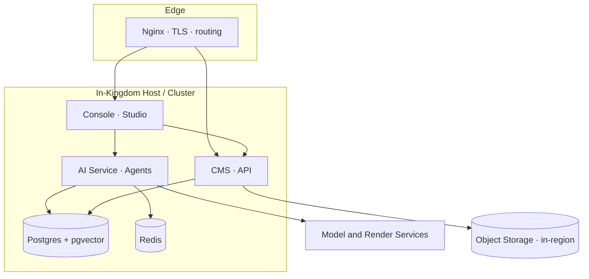

- **Stateless app tier** (console, CMS, AI service) — horizontally scalable.
- **Managed data tier** (Postgres+pgvector, Redis) with health checks.
- **One image, many services** — each container runs a different workload from a shared build.
- **Repeatable deploys** with image cache-busting per release and forced container recreation.

---

## 10. Security, Governance and Sovereignty

- **In-Kingdom** hosting and processing — data residency under HUMAIN's control.
- **RBAC + ABAC** at every layer (7 roles; site-scope, department and locale attributes) at both collection and field level. Roles/scope are admin-editable only (no self-escalation); `siteAdmin` is confined to its sites and excluded from global settings. The model is **behaviourally verified** — a per-role test suite asserts both the allowed and denied paths (create, publish gating, workflow advancement, cross-site isolation, department gating, privilege-escalation prevention, audit-log and settings access).
- **Editorial gating** — Draft → In Review → Approved; agents propose drafts, humans publish.
- **Immutable audit log** of all content *and* agent actions.
- **Secrets isolation** — credentials/keys separated from content and code.
- **Secure transport** — HTTPS/TLS everywhere; secure session cookies; CORS/CSRF protection.
- **Human-in-the-loop** — nothing reaches the public without approval.

---

## 11. Technology Stack

| Layer | Technology |
|---|---|
| Console / Web | Next.js (App Router), React, SSE streaming, EN/AR RTL |
| CMS | Payload (headless), RBAC/ABAC, versioned drafts, audit |
| AI service | Node/Fastify, Anthropic Claude (Opus + Haiku), tool-use loop |
| Agents / tools | Orchestrator + specialists; MCP governed tool surface |
| Embeddings | Local multilingual model (sovereign, 384-dim) |
| Data | Postgres + pgvector; Arabic-aware search; Redis |
| Render | Image/Video via provider-abstracted services |
| Storage | S3-compatible object storage, in-region |
| Edge / Infra | Nginx + TLS; containerised; one image, many services |

---

## 12. Scalability, Reliability and Observability

- **Scalability:** stateless app tier scales horizontally; queue-backed background work absorbs spikes; cost-tuned model routing (Opus for reasoning, Haiku for generation).
- **Reliability:** health-checked data tier; restart-on-failure services; graceful degradation (a missing model/render key surfaces a friendly message, never a crash).
- **Observability:** centralised logs/metrics; every agent run and content action recorded for full traceability.

---

## Appendix A — Payload CMS v3 Security Posture

The platform's content backend is **Payload CMS v3 (3.85.0)**. Payload v3 is a secure, production-grade, actively-maintained headless CMS (Figma-backed) on the Next.js App Router; security is a shared responsibility — Payload provides the primitives, and this deployment configures and hardens them.

### A.1 Built-in security controls (Payload v3)

| Control | Detail |
|---|---|
| **Authentication** | bcrypt-hashed passwords · JWT in **httpOnly** cookies · API keys · email verification · password reset · **account lockout** (`maxLoginAttempts` / `lockTime`) |
| **Authorization** | Collection- **and** field-level access-control functions → real **RBAC + ABAC** |
| **Injection defence** | Parameterised queries via **Drizzle ORM** (Postgres) |
| **Web security** | **CORS + CSRF** controls, configurable origins; inherits the **Next.js** security model |
| **Data integrity** | Versioned drafts, editorial workflow state, audit hooks |
| **Maintenance** | Actively maintained; pinned, recent **3.85.0** |

### A.2 Applied controls in this platform

| Area | Configuration |
|---|---|
| **Transport** | HTTPS/TLS · `COOKIE_SECURE=true` · secure session cookies |
| **Access control** | **RBAC (7 roles)** + **ABAC** (site, department, locale) at collection and field level |
| **Secrets** | `PAYLOAD_SECRET` and provider keys held in environment, **not committed** to source |
| **Governance** | Editorial gating (draft → review → publish) · **immutable audit log** |
| **Agentic safety** | Agents **propose drafts**; a human approves before publish |
| **Sovereignty** | Hosted **in-Kingdom**; secrets isolated from content and code |

### A.3 Hardening checklist

- Keep Payload **patched** and monitor its security advisories.
- Strong, rotated `PAYLOAD_SECRET`; restrict `/admin` exposure; MFA for maintainers.
- **Dependency / SCA scanning** (Dependabot / Snyk / `npm audit`) in CI.
- Replace the first-boot dev schema-push with **generated Payload migrations**.
- Edge **rate-limiting / WAF**; least-privilege database and registry credentials.

> No framework is free of vulnerabilities; the correct posture is to **stay current and monitor advisories**. Most real-world risk lies in weak secrets, over-permissive access rules, leaked environment variables or unpatched dependencies — all addressed above.

---

*Prepared for HUMAIN — Confidential. Master deck: Product Requirements, UI/UX & User Journeys, and High-Level Architecture for the HUMAIN Create Studio platform.*
